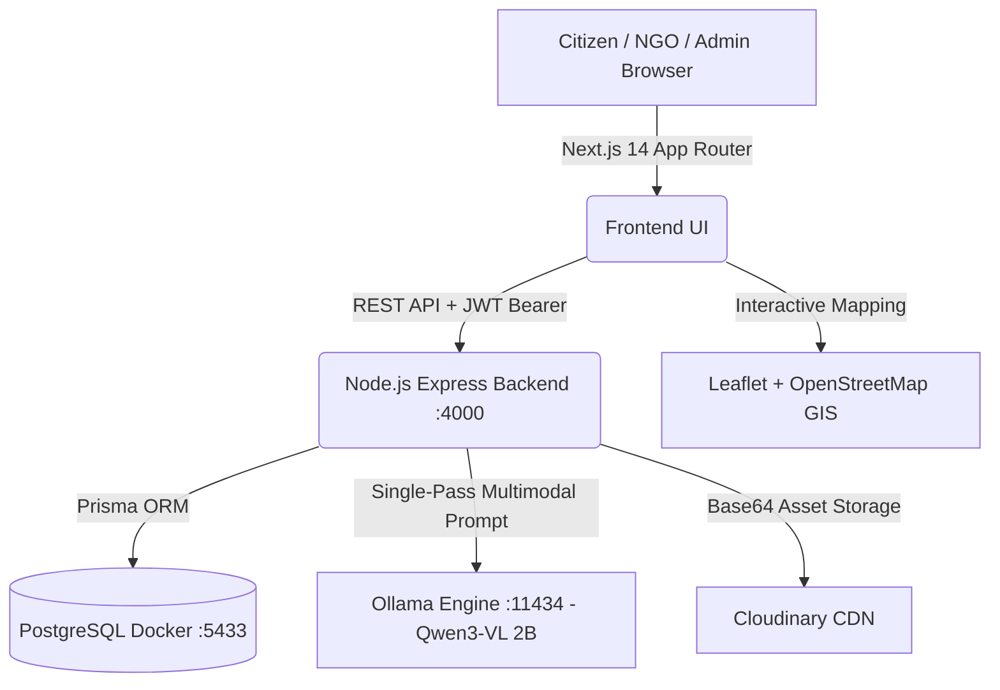
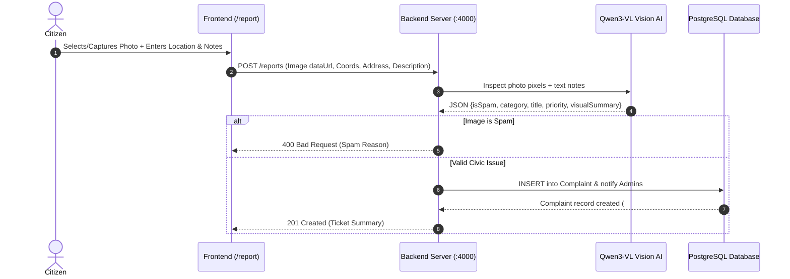
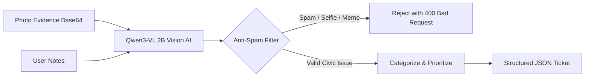
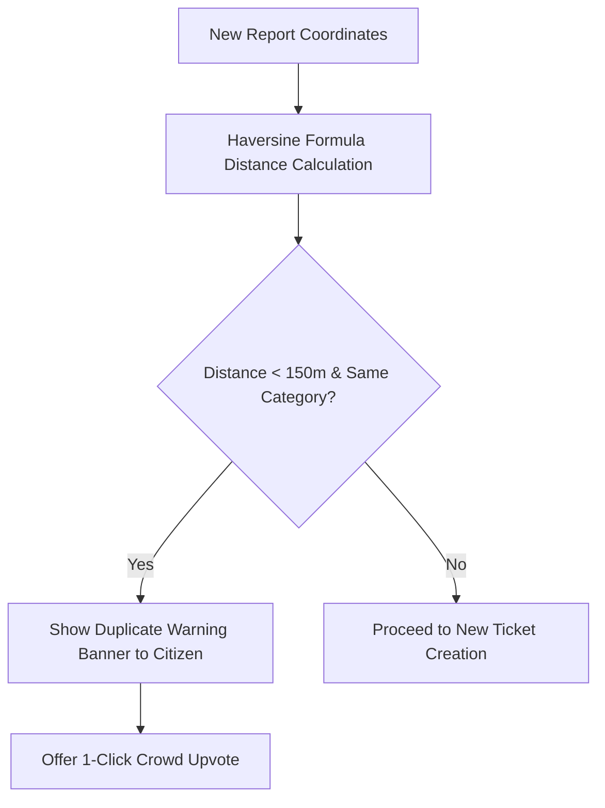
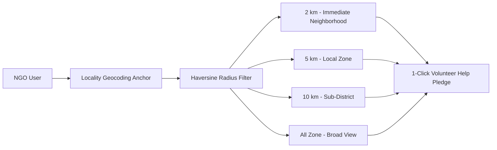
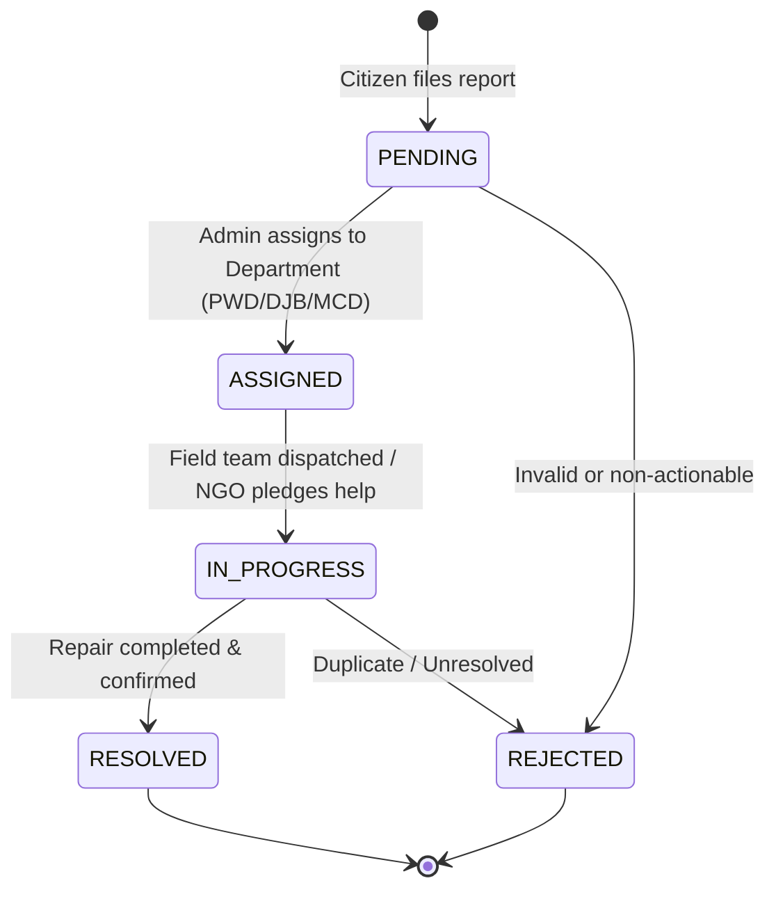
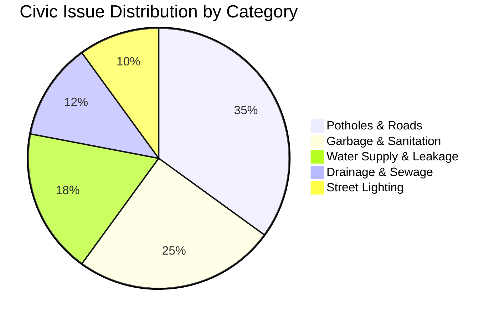
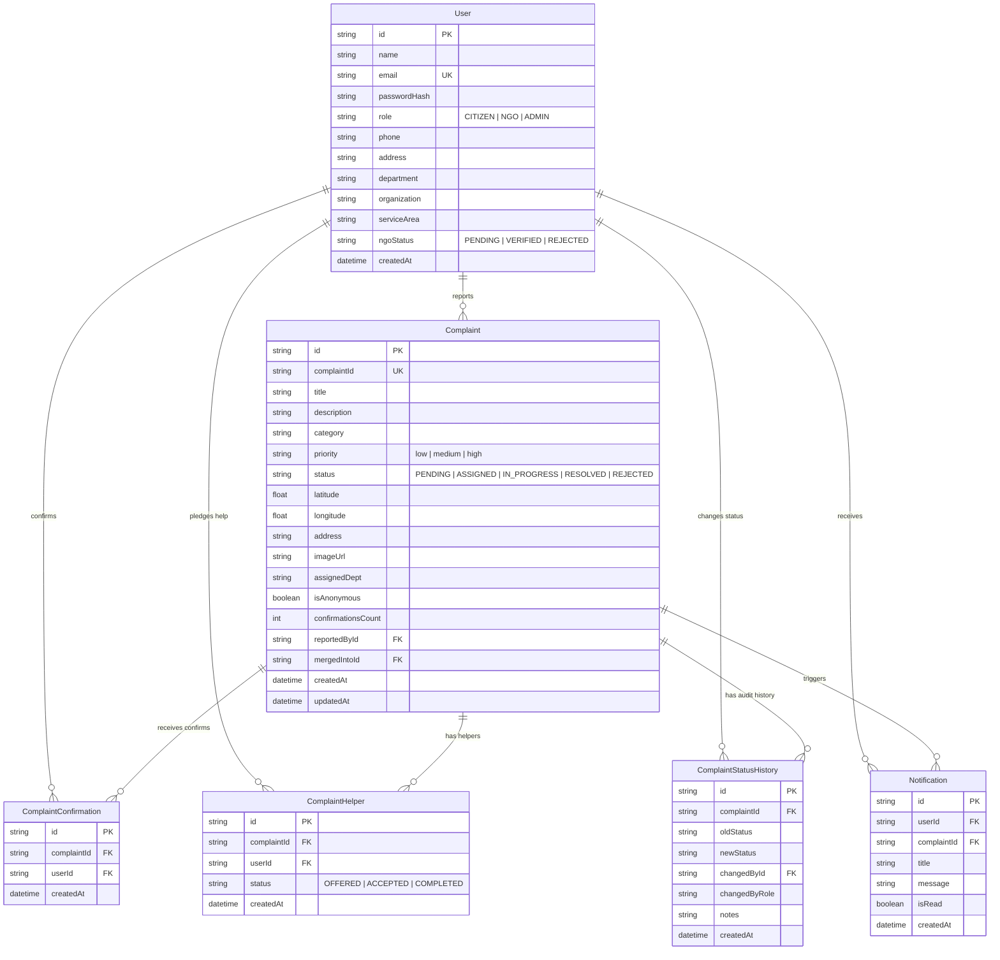

# 🏛️ JanSamvedan (जनसंवेदन) — Complete Feature & Technical Architecture Guide

JanSamvedan is an AI-powered, hyper-local civic grievance redressal and municipal collaboration platform designed for Indian urban centers. It connects **Citizens**, **NGOs/Volunteer Groups**, and **Municipal Administrators** into a transparent, closed-loop civic governance ecosystem.

---

## 📑 Table of Contents
1. [System Architecture & Technology Stack](#1-system-architecture--technology-stack)
2. [Citizen Portal & Reporting Workflow](#2-citizen-portal--reporting-workflow)
3. [AI Multimodal & Anti-Spam Engine](#3-ai-multimodal--anti-spam-engine)
4. [Duplicate Detection & Proximity Clustering](#4-duplicate-detection--proximity-clustering)
5. [NGO Action Portal & GPS Radius Filtering](#5-ngo-action-portal--gps-radius-filtering)
6. [Municipal Admin Portal & Triage Workflow](#6-municipal-admin-portal--triage-workflow)
7. [Department Performance & SLA Analytics](#7-department-performance--sla-analytics)
8. [Notification & Audit Trail System](#8-notification--audit-trail-system)
9. [GIS & Data Export Engine](#9-gis--data-export-engine)
10. [Database Schema & Data Model](#10-database-schema--data-model)
11. [Automated Test Suite & Verification](#11-automated-test-suite--verification)

---

## 1. System Architecture & Technology Stack



### Core Technologies
- **Frontend**: Next.js 14 (App Router), TypeScript, Tailwind CSS, Lucide Icons, Leaflet Maps.
- **Backend API**: Node.js, Express, TypeScript (`tsx watch` hot-reload), JWT Authentication, Bcrypt password hashing.
- **Database**: PostgreSQL 16 in Docker, managed through Prisma ORM.
- **On-Premise AI Engine**: Ollama running `qwen3-vl:2b-instruct-q4_K_M` (Vision + Language + Anti-Spam in a single pass).
- **Media & CDN**: Cloudinary image optimization pipeline.

---

## 2. Citizen Portal & Reporting Workflow

The Citizen Portal (`/report`, `/citizen/dashboard`, `/my-reports`) allows citizens to report civic infrastructure issues in seconds with zero friction.



### Key Citizen Features:
1. **Mandatory Photo Evidence**:
   - Reports require clear photo evidence. The system enforces photo attachment before submission to eliminate phantom or unverifiable tickets.
2. **Auto-Reverse Geocoding & Interactive Pin**:
   - 1-click **Current GPS Location** captures device coordinates.
   - Interactive **Leaflet Map Picker** allows fine-grained manual pin dropping across sectors and streets.
   - Integrated OpenStreetMap reverse-geocoding automatically translates coordinates into readable Indian locality addresses.
3. **Crowd-Verification & Upvoting (`POST /reports/:id/confirm`)**:
   - If a citizen notices an issue already reported by someone else, they can click **"Confirm Issue"** instead of filing a duplicate.
   - Self-confirmation is prevented. Each unique confirmation increments the ticket's crowd weight and raises its priority score.
4. **Anonymous Reporting**:
   - Citizens can toggle **"Report Anonymously"** to mask their identity and personal contact info from public and NGO dashboards while still tracking ticket status.

---

## 3. AI Multimodal & Anti-Spam Engine

JanSamvedan utilizes **`qwen3-vl:2b-instruct`** running locally via Ollama to perform unified single-pass multimodal analysis:



### 1. Anti-Spam & Validity Screening
Before any database record is created, the vision model inspects the image for:
- Selfies, personal portraits, animal/pet photos.
- Memes, screenshots, promotional flyers, advertisements.
- Completely black, blank, or unrecognizable images.
- If flagged, the API rejects the submission immediately with a helpful explanation.

### 2. Civic Taxonomy Classification
The model maps the issue into 9 standard municipal categories:
- **Pothole** (Road craters, asphalt cracks, damaged pavements)
- **Garbage Collection** (Overflowing dumpsters, roadside trash piles, animal scavengers)
- **Street Light** (Defective sodium lamps, dark alleys, dangling fixture wires)
- **Water Supply** (Pipeline burst, potable water leakage, low pressure)
- **Drainage** (Sewage overflow, open manholes, choked storm drains)
- **Traffic Signal** (Blinking lights, dead traffic signals, damaged timer boxes)
- **Park Maintenance** (Broken benches, overgrown bushes, damaged children's swings)
- **Encroachment** (Illegal stalls, unauthorized footpath occupation)
- **Tree Hazard** (Uprooted trees, hazardous hanging branches)

### 3. Visual Severity & Priority Rating
The AI evaluates real-world hazard levels:
- **`high`**: Open manholes, live dangling electrical wires, major pipeline floods, road craters blocking main transit arteries.
- **`medium`**: Overflowing community dumpsters, defective streetlights on inner roads.
- **`low`**: Minor aesthetic blemishes, small roadside litter, faded signage.

---

## 4. Duplicate Detection & Proximity Clustering

To prevent municipal departments from being flooded with multiple reports for the same physical pothole or broken light, JanSamvedan implements a dual-layer proximity algorithm:



### Mathematical Haversine Distance Formula:
$$d = 2R \arcsin\left(\sqrt{\sin^2\left(\frac{\Delta \phi}{2}\right) + \cos(\phi_1)\cos(\phi_2)\sin^2\left(\frac{\Delta \lambda}{2}\right)}\right)$$
- **$\Delta \phi$**: Latitude difference in radians.
- **$\Delta \lambda$**: Longitude difference in radians.
- **$R$**: Earth's radius ($6,371\text{ km}$).

1. **Citizen Proximity Check (`POST /reports/find-duplicates`)**:
   - When a citizen selects a location, the frontend queries nearby active complaints within $150\text{ meters}$.
   - Shows existing issues with photo thumbnails and confirmation counters.
2. **Admin Cluster Merge (`GET /admin/duplicate-clusters` & `POST /reports/merge-duplicates`)**:
   - Groups complaints located within $200\text{ meters}$ having matching categories.
   - Municipal admins can merge duplicate tickets into a single primary ticket with aggregated confirmations.

---

## 5. NGO Action Portal & GPS Radius Filtering

The NGO Portal (`/ngo/dashboard`) empowers verified non-profit organizations and volunteer groups to discover and resolve civic issues in their service territories.



### Key NGO Capabilities:
1. **Locality Anchor GPS Lookup**:
   - Resolves the NGO's registered service area (e.g. *"Sector 7, Sector 11, Rohini"*) into exact GPS anchor coordinates ($28.7041^\circ\text{N}, 77.1165^\circ\text{E}$).
2. **Interactive Circular Radius Pills**:
   - **`2 km`**: Hyper-local neighborhood radius.
   - **`5 km`**: Ward/Zonal territory.
   - **`10 km`**: Extended municipal district.
   - **`All Zone`**: Full city overview.
3. **Proximity Sort & Distance Badges**:
   - Every card displays distance from the NGO's anchor: `📍 350m away`, `📍 1.8km away`.
   - 1-click **Closest First** sort prioritizes nearest issues.
4. **Volunteer Help Pledges (`POST /helpers/:id/help`)**:
   - NGOs can pledge assistance (e.g. volunteer cleanup squad, sapling plantation, temporary barricading).
   - Adds the organization to the ticket's helper list and notifies citizens and admins.

---

## 6. Municipal Admin Portal & Triage Workflow

The Admin Portal (`/admin/dashboard`, `/admin/ngos`) provides municipal officers with total oversight, automated ticket routing, and SLA compliance tracking.



### Admin Operations:
1. **Zonal Triage & Department Dispatch**:
   - Assigns complaints to specific municipal authorities (Public Works Department, Delhi Jal Board, MCD Rohini Zone, Delhi Traffic Police, Horticulture Dept).
   - Changes status (`PENDING` $\rightarrow$ `ASSIGNED` $\rightarrow$ `IN_PROGRESS` $\rightarrow$ `RESOLVED`).
2. **Dynamic Priority Computation**:
   - Computes weighted priority combining:
     $$\text{Priority Score} = \text{AI Severity Weight} + (2 \times \text{Confirmations}) + \text{Aging Factor}$$
3. **NGO Directory & Verification**:
   - Review pending NGO registrations, verify organizational credentials, and approve/decline status (`VERIFIED` / `REJECTED`).
4. **Duplicate Cluster Resolution**:
   - Merge multiple redundant citizen tickets into a single master ticket with unified audit notes.

---

## 7. Department Performance & SLA Analytics

The Analytics engine (`/analytics/overview`, `/analytics/detailed`) provides real-time governance metrics:



### Key Metrics Tracked:
- **Resolution Rate**: Percentage of complaints successfully resolved ($\frac{\text{Resolved}}{\text{Total}} \times 100$).
- **Average Turnaround Time (TAT)**: Time in days from ticket creation (`createdAt`) to final resolution (`updatedAt`).
- **Department Performance Matrix**:
  - Breakdown by department (Total assigned, Resolution rate %, Average response days).
  - SLA Grade: `Excellent` ($\ge 80\%$), `Good` ($70-79\%$), `Average` ($60-69\%$), `Needs Improvement` ($<60\%$).
- **6-Month Resolution Velocity Trends**: Longitudinal submission vs. resolution comparison.

---

## 8. Notification & Audit Trail System

Every action taken on a complaint triggers real-time updates and an immutable audit trail:

- **Audit Trail (`ComplaintStatusHistory`)**:
  - Logs `oldStatus`, `newStatus`, `changedById`, `changedByRole`, `notes`, and timestamp.
  - Visible to citizens to maintain complete institutional transparency.
- **In-App Notifications (`Notification`)**:
  - Notifies citizens when their report is reviewed, dispatched, or resolved.
  - Notifies NGOs when a complaint they pledged help on is updated.
  - Notifies municipal admins whenever new high-priority complaints are filed.

---

## 9. GIS & Data Export Engine

Allows municipal authorities to export complaint data for external GIS mapping and reporting:

- **GeoJSON GIS Points (`GET /export/map/geojson`)**:
  - Standards-compliant `FeatureCollection` with Point coordinates (`[longitude, latitude]`) and rich properties for ArcGIS, QGIS, and Google Earth.
- **CSV Data Export (`GET /export/reports/csv`)**:
  - Full tabular export including Ticket ID, Category, Priority, Address, Reporter Name, Department, Status, and Timestamps.

---

## 10. Database Schema & Data Model



---

## 11. Automated Test Suite & Verification

The project includes an end-to-end automated test runner located in `testing/`:

### How to Run:
```bash
npm test
```

### Coverage:
- **36 / 36 Automated Tests** passing across 5 dedicated suites:
  1. `auth.test.ts` (Login, Registration, JWT validity, 401 handling)
  2. `reports.test.ts` (Mandatory photo check, Qwen3-VL classification, confirmations, duplicates)
  3. `ngo-gps.test.ts` (GPS circular radius filtering, distance calculations, volunteer pledges)
  4. `admin-analytics.test.ts` (Triage, SLA calculations, CSV/GeoJSON exports)
  5. `frontend-routes.test.ts` (Next.js route compilation & HTTP 200 checks)
